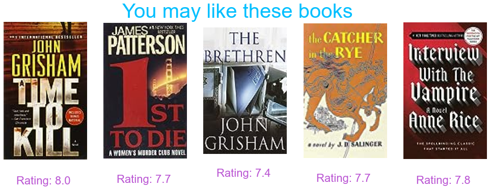

# Books Dataset Recommender System
Building a collaborative filtering recommender systems on books dataset

[Dataset on kaggle](https://www.kaggle.com/datasets/arashnic/book-recommendation-dataset)

## Contents
We have 3 dataframes and we do data cleaning and eda for each
### Data cleaning
* Removing unnecessary columns
* Renaming columns
* Check for NaN and duplicates
* convert types

### Data understanding and EDA
* Different plots
* Data queries
* Relation between datasets

### Data preprocessing
* Merging datasets
* Removing columns
* Removing NaN and duplicates
* Removing no rating values (zero)

### Modeling 
In this part we use collaborative filtering method to build a recommender system. We use both item-based and user-based.

* ### Item-based 
    Here, we explore the relationship between the pair of items (the user who bought Y, also bought Z)

  **Sample for Wild Animus book**
    

* ### User-based
  Here, we look for the users who have rated various items in the same way
  
  **Sample for a random user**
  
  